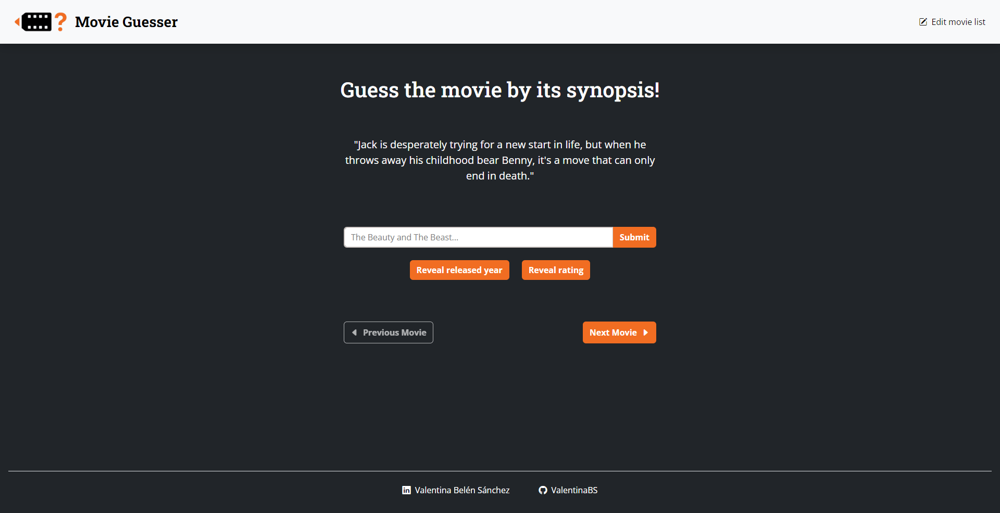
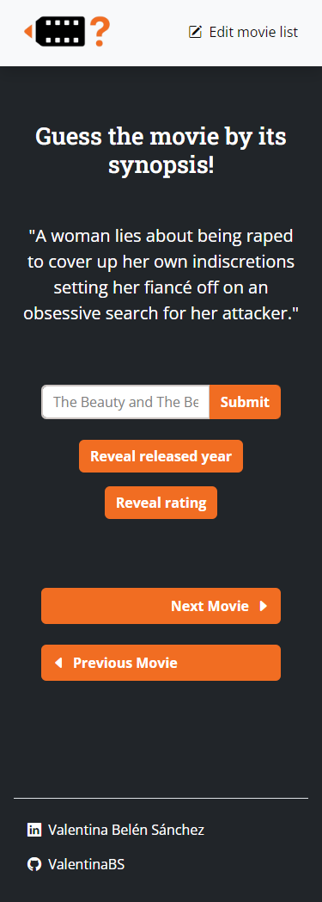

# Movie Guesser - CRUD project

This project was created for the Full Stack Web Development Course from [SomosCoders](https://somoscoders.org/es).

## Overview

### The Task

Users should be able to:

- View the optimal layout for the site depending on their device's screen size.
- Guess the name of a movie based on its synopsis.
- Recieve feedback on their answers and reveal extra clues.
- Add, edit or delete a movie from the movie list.

### Screenshots

### Built with

- Semantic HTML5 markup
- CSS custom properties
- Mobile-first workflow
- JavaScript
- Vue.js
- MySQL
- Express

## Author

- Linkedin - [Valentina Belén Sánchez](https://www.linkedin.com/in/valentina-belen-sanchez/)
- Github - [ValentinaBS](https://github.com/ValentinaBS)

---

# Movie Guesser - Proyecto CRUD

Este proyecto fue creado para el curso de Desarrollo Web Full Stack de [SomosCoders](https://somoscoders.org/es).

## Visión General

### La Tarea

Los usuarios deberían ser capaces de:

- Ver el diseño óptimo del sitio en función del tamaño de la pantalla de su dispositivo.
- Adivinar el nombre de una película a partir de su sinopsis.
- Recibir feedback sobre sus respuestas y revelar pistas adicionales.
- Añadir, editar o eliminar una película de la lista.

### Screenshots

### Hecho con

- HTML5 Semántico
- CSS
- Flexbox
- Flujo de trabajo Mobile-first
- JavaScript
- Vue.js
- MySQL
- Express

## Autora

- Linkedin - [Valentina Belén Sánchez](https://www.linkedin.com/in/valentina-belen-sanchez/)
- Github - [ValentinaBS](https://github.com/ValentinaBS)